# QA Toolkit 操作手册

> 一个让测试工程师从「手动搬砖」变成「按需输出」的全场景工具平台

---

## 你是不是也遇到过这些问题？

- 联调前临时造数据，手写十几行随机字符串，结果和开发说"这个格式不对"？
- 收到一份几十页的需求文档，不知道从哪里开始写用例？
- 接口文档改了版本，要手动 diff 才能找到变化的字段？
- 上线前想做安全基线检查，但不知道从何下手？
- 压测报告要整理，数据散落在各个地方，汇总起来花了一下午？

**QA Toolkit 就是为这些场景而生的。**

它不是一堆脚本的堆砌，而是把测试工程师最高频、最痛的工作场景，整合进一个本地可运行的工具平台，让你从繁琐的准备工作里解放出来，把精力留给真正需要判断力的地方。

---

## 目录

1. [平台定位与快速启动](#1-平台定位与快速启动)
2. [数据生成工具](#2-数据生成工具)
3. [测试用例生成器](#3-测试用例生成器)
4. [接口研发辅助](#4-接口研发辅助)
5. [接口自动化测试](#5-接口自动化测试)
6. [接口性能测试](#6-接口性能测试)
7. [接口安全测试](#7-接口安全测试)
8. [禅道绩效统计](#8-禅道绩效统计)
9. [通用效率工具](#9-通用效率工具)
   - [文本对比](#文本对比工具) · [JSON 处理](#json-处理工具) · [正则测试](#正则测试工具) · [日志分析](#日志分析工具)
   - [字数统计](#字数统计工具) · [时间处理](#时间处理工具) · [IP/域名查询](#ip域名查询工具) · [加密/解密](#加密解密工具) · [图片处理](#图片处理工具) · [BI 数据分析](#bi-数据分析工具)
10. [典型工作流](#10-典型工作流)

---

## 1. 平台定位与快速启动

### 整体界面


平台首页以「测试工程师常用工具集」为核心定位，覆盖六大能力域：

| 能力域 | 包含工具 |
|---|---|
| 正则与文本 | 正则测试、文本对比、字数统计 |
| 日志与 JSON | 日志分析、JSON 处理 |
| 接口与分析 | 接口研发辅助、接口自动化、接口性能、接口安全 |
| 一站式入口 | 数据生成、测试用例生成、禅道绩效统计 |
| 工程化提效 | 时间处理、加密/解密、IP/域名、图片处理 |
| 面向测试实战 | BI 数据分析 |

### 快速启动

```bash
# 安装依赖
python3 -m pip install -r requirements.txt

# 启动平台
python3 -m streamlit run streamlit_app.py
```

浏览器自动打开 `http://localhost:8501`，左侧边栏为工具列表，点击即可切换。

> **macOS OCR 支持（可选）：**
> ```bash
> brew install tesseract tesseract-lang
> ```

---

## 2. 数据生成工具

### 界面预览

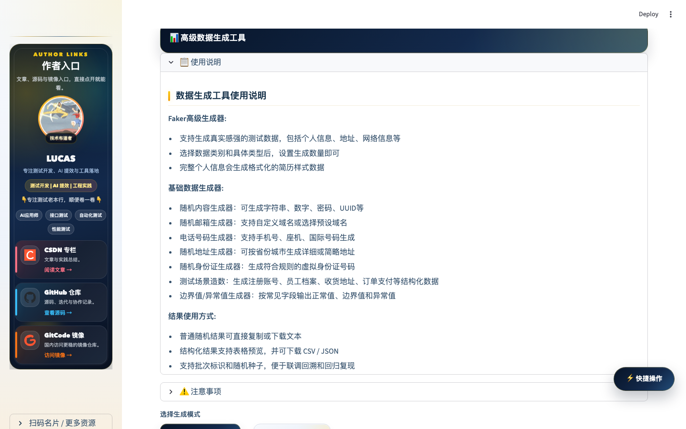

### 工具定位

联调造数、回归准备、边界值设计——三类场景全覆盖。输入参数，一键生成，结果支持表格预览和 CSV/JSON 下载，不需要手写任何代码。

### 四大功能详解

#### Faker 高级生成器

生成有「真实感」的结构化数据，而不是随机乱码。

**支持的数据类型：**

| 类别 | 可生成字段 |
|---|---|
| 个人信息 | 中文姓名、手机号、邮箱、身份证号、性别、年龄 |
| 地址信息 | 省市区、详细地址、邮编、经纬度 |
| 公司信息 | 公司名、职位、部门、统一信用代码 |
| 网络信息 | IPv4/IPv6、MAC 地址、URL、域名、User-Agent |
| 日期时间 | 日期、时间戳、时间区间内随机日期 |
| 文本内容 | 中文段落、句子、词语 |

**使用流程：**
1. 选择数据类别（如「个人信息」）
2. 勾选需要的具体字段
3. 设置生成条数（支持批次标识和随机种子）
4. 点击生成，预览表格后下载 CSV 或 JSON

> **场景举例：** 注册接口联调，需要 50 条含姓名、手机号、邮箱的用户数据。选「个人信息」类别，勾选三个字段，输入 50，导出 CSV，直接给开发导入。

---

#### 基础随机生成器

快速生成单字段值，适合即用即取，无需配置。

| 生成类型 | 说明 |
|---|---|
| 随机字符串 | 可指定长度、字符集（字母/数字/混合/特殊符号） |
| 随机数字 | 指定范围和位数 |
| UUID | 标准 UUID v4 格式 |
| 密码 | 指定长度、复杂度规则 |
| 邮箱 | 支持自定义域名或随机域名 |
| 手机号 | 国内手机号（支持座机、国际区号） |
| 身份证号 | 符合校验规则的虚拟身份证 |
| 地址 | 按省市区生成详细地址 |

> **场景举例：** 测试密码强度校验接口，分别生成：纯数字 8 位、纯字母 8 位、混合 8 位、超长 100 位，各复制一次直接填入请求参数。

---

#### 测试场景造数

按完整业务场景批量生成结构化数据集，适合导入测试和批量接口验证。

**内置场景包含：**
- 注册账号（用户名/手机号/邮箱/密码）
- 员工档案（姓名/工号/部门/职位/入职日期）
- 收货地址（姓名/手机号/省市区/详细地址/是否默认）
- 订单支付（订单号/金额/商品名/支付方式/状态）

> **场景举例：** 地址管理模块回归测试，需要 20 条覆盖不同省份的收货地址数据。选「收货地址」场景，设定 20 条，下载 CSV，批量导入系统，直接开始回归。

---

#### 边界值 / 异常值生成器

按字段类型自动推导正常值、边界值和异常值，是测试设计阶段最直接的输入。

**字符串字段示例（规则：长度 1-20，非空）：**

| 类型 | 示例值 | 覆盖意图 |
|---|---|---|
| 正常值 | `hello_world` | 合法输入验证 |
| 最小边界 | `a` | 最短合法值 |
| 最大边界 | `abcdefghij1234567890` | 最长合法值 |
| 超出上界 | `abcdefghij12345678901` | 超长拒绝验证 |
| 空字符串 | `` | 必填校验 |
| 空格 | `   ` | 空白字符处理 |
| SQL 注入 | `' OR 1=1 --` | 注入防护验证 |
| 特殊字符 | `<script>alert(1)</script>` | XSS 防护验证 |
| Unicode | `🎉测试😊` | 编码兼容性 |

> **场景举例：** 用户名字段校验测试，输入字段名和长度规则，工具自动输出全套边界值和异常值，直接用于测试用例设计，省去手动推导。

### 实用技巧

- 批次标识写清楚（如 `qa0410`、`regression_v2`），方便后续追溯是哪批数据
- 回归场景填写**随机种子**，同参数可复现完全相同的一批数据
- 造完数据优先下载文件，不要只复制文本，方便多次复用

---

## 3. 测试用例生成器

### 界面预览

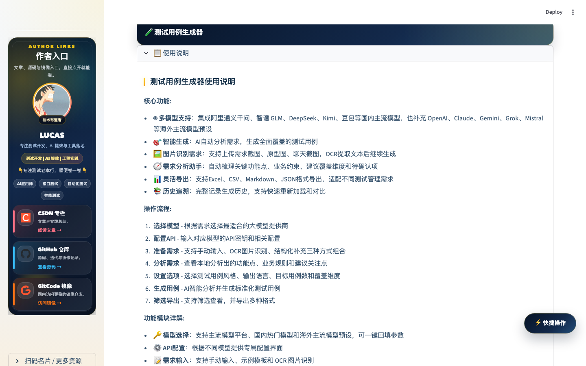

### 工具定位

把「读需求文档→提取功能点→设计覆盖维度→写用例」这个费时费力的过程，变成「输入需求→模型生成→人工筛选确认」，让初稿生成从几小时缩短到几分钟。

### 核心能力

| 能力 | 说明 |
|---|---|
| 多模型支持 | 通义千问、智谱 GLM、DeepSeek、Kimi、豆包、OpenAI、Claude、Gemini、Grok、Mistral |
| 智能生成 | AI 自动分析需求，生成全面覆盖的测试用例 |
| 图片识别需求 | 上传需求截图、原型图、聊天截图，OCR 提取文字后继续生成 |
| 需求分析助手 | 自动梳理功能点、业务约束、建议覆盖维度和待确认项 |
| 灵活导出 | Excel、CSV、Markdown、JSON 格式导出 |
| 历史追溯 | 完整记录生成历史，支持快速重新加载和对比 |

### 完整使用流程

```
Step 1  选择模型
        根据需求复杂度选模型分组：
        免费示范 → 体验演示
        均衡 → 日常迭代用例
        旗舰 → 复杂业务规则
        推理 → 深度边界分析

Step 2  配置 API
        填入所选平台的 API Key（免费示范组无需填写）

Step 3  准备需求（支持三种方式组合使用）
        ① 手动输入：直接粘贴需求文本
        ② 图片 OCR：上传截图自动识别文字
        ③ 结构化补充：填入模块名、业务规则、验收标准、不覆盖范围

Step 4  分析需求
        点击「需求分析助手」，查看：
        - 识别出的功能点列表
        - 提取的业务规则和约束
        - 建议覆盖的测试维度
        - 需要确认的模糊需求项

Step 5  设置选项
        - 目标用例数（建议先设 10-20 条，确认质量后再扩大）
        - 输出语言（中文 / 英文）
        - 测试风格（功能覆盖型 / 边界探索型 / 安全验证型）
        - 覆盖维度（正常流程 / 异常分支 / 边界值 / 权限 / 性能）

Step 6  生成用例
        AI 分析需求并输出结构化用例，包含：
        用例编号、所属模块、用例标题、前置条件、操作步骤、预期结果、优先级

Step 7  筛选导出
        按模块、优先级筛选，导出 Excel/CSV 到测试管理工具
```

### 多模型选择指南

| 分组 | 代表模型 | 最适合场景 |
|---|---|---|
| 免费示范 | 智谱 GLM-4.7-Flash | 第一次试用、演示给他人看 |
| 均衡 | 通义 Qwen-Flash、文心一言 | 日常迭代、大批量生成 |
| 旗舰 | GPT-4o、DeepSeek-V3 | 复杂业务规则、高质量要求 |
| 推理 | o1、DeepSeek-R1 | 深度边界推导、安全规则分析 |

### 需求输入最佳实践

**手动输入模板：**
```
【功能名称】用户新增收货地址

【需求描述】
用户可在 App 端新增收货地址。
新增地址时姓名、手机号、省市区、详细地址为必填项，手机号需校验格式。
一个用户只能有一个默认地址；勾选默认地址时，原默认地址自动取消。
保存成功后返回地址列表页并立即展示最新地址。

【业务规则】
- 手机号格式：11位国内手机号，1开头
- 地址数量上限：每用户最多 20 条

【验收标准】
- 新增成功后地址列表第一条展示新地址
- 手机号格式错误时，保存按钮置灰或给出明确提示

【本次不覆盖】
- 地址编辑和删除功能
- 境外地址
```

> **建议：** 先看需求分析助手的「待确认项」，把不清晰的地方补充说明再生成，质量会明显更高。

---

## 4. 接口研发辅助

### 界面预览

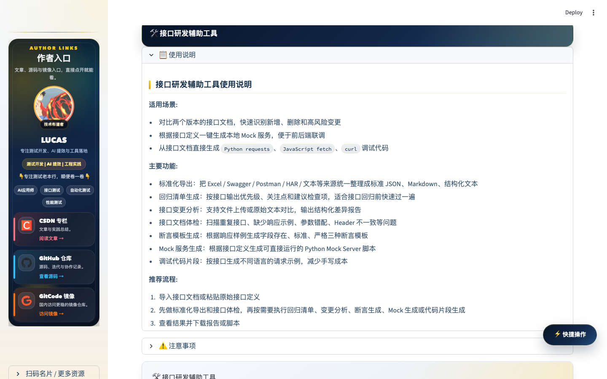

### 工具定位

接口文档质量参差不齐：字段缺描述、必填项不明确、版本更新后变化不透明。这个工具帮你在真正开始测试之前，先把文档梳理清楚，并按需生成回归清单、Mock 脚本和调试代码。

### 七大功能详解

#### 文档标准化导出

把来自不同来源的接口定义（Excel/Swagger/Postman/HAR/Bruno/.bru/文本）统一整理成标准 JSON 或 Markdown 格式，消除格式差异，方便后续处理。

**支持导入格式：**
`xlsx` · `xls` · `json` · `har` · `bru` · `txt` · `md` · `yaml` · `yml`

**自动处理内容：**
- 补全缺失的字段描述
- 统一请求方法大小写
- 规范化参数名称和类型
- 整理响应示例格式

---

#### 接口体检

扫描接口文档，输出结构性问题清单，让你在开始测试前就知道哪些地方有隐患。

**检查项包含：**

| 检查项 | 说明 |
|---|---|
| 重复接口 | 相同路径和方法的接口重复定义 |
| 缺少响应示例 | 接口没有任何成功/失败响应示例 |
| 参数缺少描述 | 请求参数没有中文或英文说明 |
| Header 不一致 | 同一文档中认证 Header 命名不统一 |
| 必填参数未标注 | required 字段缺失或不明确 |
| 类型不合法 | 参数类型与示例值不匹配 |

---

#### 接口变更分析

上传两个版本的接口文档，自动对比差异，输出结构化变更报告。

**变更类型识别：**
- 🟢 **新增接口**：新版本中出现的接口
- 🔴 **删除接口**：旧版本存在但新版本移除的接口
- 🟡 **修改接口**：路径相同但参数、响应结构发生变化
  - 新增字段 / 删除字段 / 字段类型变更 / 字段描述变更

> **场景举例：** 版本迭代后，开发说"只改了几个接口"，实际上文档里改了十几个。通过变更分析一键找出所有差异，生成精准的回归范围。

---

#### 回归清单生成

基于接口体检和变更分析的结果，自动生成带优先级的回归接口清单。

**清单内容：**
- 接口名称和路径
- 变更类型标注（新增 / 修改 / 高风险）
- 建议测试优先级（P0/P1/P2）
- 关联的风险点描述
- 建议检查项

---

#### 断言模板生成

根据接口的响应示例，自动生成三种严格级别的断言代码片段。

**三种断言级别：**

```python
# 存在性断言（最宽松）
assert "data" in response.json()
assert "userId" in response.json()["data"]

# 标准断言（推荐）
assert response.status_code == 200
assert response.json()["code"] == 0
assert isinstance(response.json()["data"]["userId"], int)

# 严格断言（最严格）
assert response.status_code == 200
assert response.json() == {
    "code": 0,
    "message": "success",
    "data": {"userId": 12345, "name": "张三"}
}
```

---

#### Mock 服务生成

根据接口定义生成可直接运行的 Python Mock Server 脚本，前端联调时不需要等后端接口就绪。

**生成内容示例：**
```python
from flask import Flask, jsonify
app = Flask(__name__)

@app.route('/user/address', methods=['POST'])
def create_address():
    return jsonify({
        "code": 0,
        "message": "success",
        "data": {"addressId": 1001}
    })

if __name__ == '__main__':
    app.run(port=8080)
```

---

#### 调试代码片段生成

一键生成不同语言的接口调试代码，减少手写重复样板代码的时间。

**支持语言：**
- Python（`requests` 库）
- JavaScript（`fetch` / `axios`）
- cURL 命令行

**Base URL 支持下拉选择：** 页面内可预设多个环境地址（开发/测试/预发/生产），切换环境时代码自动同步更新，不需要手动替换。

---

### 推荐使用顺序

```
情况：接口文档很乱
→ 先「文档标准化」→ 再「接口体检」

情况：准备联调
→ 先「Mock 服务生成」→ 再「调试代码片段生成」

情况：准备版本回归
→ 先「变更分析」→ 再「回归清单生成」

情况：准备接口自动化
→ 先「接口体检」→ 再「断言模板生成」
```

---

## 5. 接口自动化测试

### 界面预览

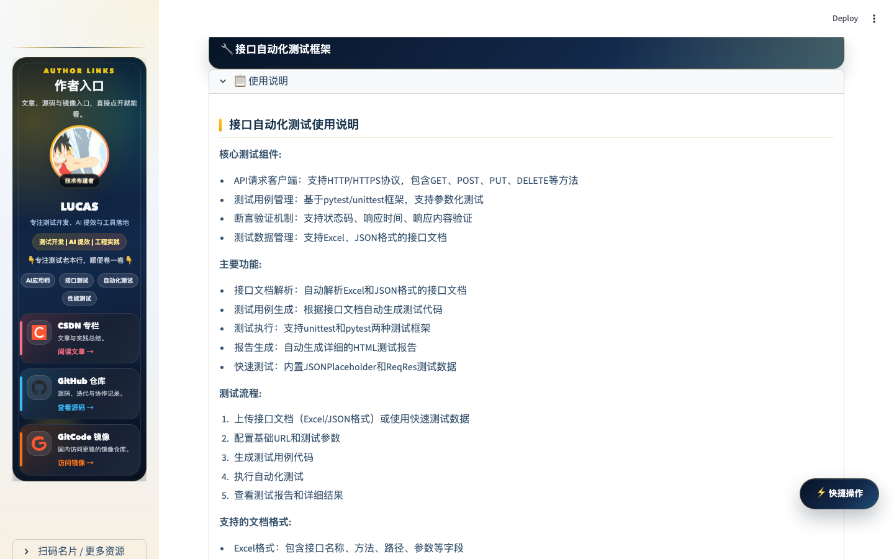

### 工具定位

从接口文档到可执行测试脚本，全程不需要手写代码。导入文档、配置参数、生成脚本、一键执行、查看 HTML 报告——五步完成接口基础回归。

### 核心组件

| 组件 | 功能 |
|---|---|
| API 请求客户端 | 支持 HTTP/HTTPS，GET / POST / PUT / DELETE / PATCH |
| 测试用例管理 | 基于 pytest/unittest 框架，支持参数化测试 |
| 断言验证机制 | 状态码断言、响应时间断言、响应内容断言 |
| 测试数据管理 | 支持 Excel、JSON 格式接口文档 |
| 快速测试数据 | 内置 JSONPlaceholder 和 ReqRes 公共测试接口 |

### 支持的文档格式

| 格式 | 说明 |
|---|---|
| Excel（.xlsx/.xls） | 包含接口名称、方法、路径、参数等字段的表格 |
| JSON / Apifox / Postman / HAR / Insomnia | 自动检测 JSON 系列格式 |
| Swagger / OpenAPI | 支持 URL 导入或文件上传 |
| 结构化文本 | 自然语言描述的接口定义 |
| Bruno .bru | Bruno API 客户端格式 |
| 内置示例 | JSONPlaceholder 用户/文章接口、ReqRes 用户接口 |

### 环境与认证配置

**多环境支持：**
可配置多个环境（开发/测试/预发/生产），切换环境时 Base URL 自动替换，不影响接口定义。

**统一鉴权模式：**

| 认证类型 | 配置方式 |
|---|---|
| Bearer Token | `Authorization: Bearer <token>` |
| API Key | 自定义 Header 名称和值 |
| Basic Auth | 用户名 + 密码（自动 Base64 编码） |
| 自定义 Header | 任意 Header 键值对 |

> **提示：** 鉴权配置一次后对当前文档所有接口生效，不需要逐个接口配置。

### 运行时依赖说明

自动化测试执行前会检查运行时依赖：
- `requests`、`pandas`、`openpyxl` 是基础依赖（通常已安装）
- `pytest` 仅在选择 pytest 模式执行时才检查
- 如有缺失，页面提供一键安装入口（可选择国内镜像源：清华/阿里云/豆瓣/中科大）
- **执行模式必须与生成脚本模式一致**：生成了 pytest 脚本就用 pytest 执行，不能混用

**Excel 文档格式要求：**

| 接口名称 | 请求方法 | 请求路径 | 请求参数 | 期望状态码 | 响应示例 |
|---|---|---|---|---|---|
| 获取用户列表 | GET | /users | page=1&limit=10 | 200 | {"code":0,"data":[...]} |
| 新增用户 | POST | /users | {"name":"张三"} | 201 | {"code":0,"id":1} |

### 完整使用流程

```
Step 1  上传接口文档
        ↓ 支持 Excel / JSON，或直接选「内置快速测试数据」

Step 2  解析预览
        ↓ 系统自动解析出接口列表，逐条查看路径、方法、参数

Step 3  配置测试参数
        ↓ 填入 Base URL（测试环境地址）
        ↓ 配置认证 Header（如 Authorization: Bearer <token>）
        ↓ 选择脚本框架（pytest / unittest）

Step 4  生成测试脚本
        ↓ 点击「生成测试用例代码」
        ↓ 预览生成的脚本内容

Step 5  执行测试
        ↓ 点击「执行自动化测试」
        ↓ 实时查看执行进度和日志

Step 6  查看报告
        ↓ 自动生成 HTML 报告
        ↓ 报告保存到 workspace/reports/
        ↓ 页面内可直接预览，也可下载
```

### 生成脚本示例

```python
import pytest
import requests

BASE_URL = "https://api-test.example.com"
HEADERS = {"Authorization": "Bearer <your-token>"}

class TestUserAPI:
    """用户接口自动化测试"""

    def test_get_user_list(self):
        """GET /users - 获取用户列表"""
        response = requests.get(
            f"{BASE_URL}/users",
            params={"page": 1, "limit": 10},
            headers=HEADERS,
            timeout=10
        )
        assert response.status_code == 200
        data = response.json()
        assert data["code"] == 0
        assert isinstance(data["data"], list)

    def test_create_user(self):
        """POST /users - 新增用户"""
        response = requests.post(
            f"{BASE_URL}/users",
            json={"name": "张三", "email": "zhangsan@example.com"},
            headers=HEADERS,
            timeout=10
        )
        assert response.status_code == 201
        assert response.json()["code"] == 0
```

> **建议：** 导入文档前先用「接口研发辅助」做一次体检，能减少残缺文档引发的脚本生成错误。Base URL 填测试环境地址，不要直接打生产。

---

## 6. 接口性能测试

### 界面预览

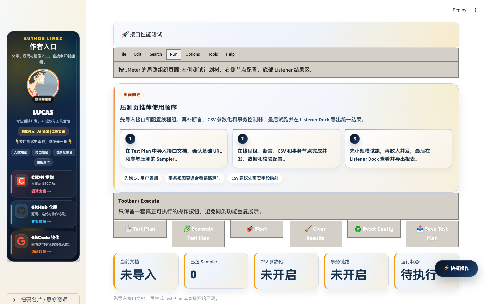

### 工具定位

JMeter 风格的接口压测能力，在浏览器里配完参数就能跑，无需单独搭环境。按 JMeter 的思路组织页面：左侧测试计划树、右侧节点配置、底部 Listener 结果区。

### 操作工具栏

界面顶部提供六个核心操作按钮：

| 按钮 | 功能 |
|---|---|
| Test Plan | 查看和编辑测试计划结构 |
| Generate Test Plan | 根据导入的接口文档自动生成测试计划 |
| Start | 启动压测执行 |
| Clear Results | 清空当前测试结果 |
| Reset Config | 重置所有配置到初始状态 |
| Save Test Plan | 保存当前测试计划配置 |

### 压测前状态仪表盘

页面底部实时展示五个关键状态：

| 指标 | 说明 |
|---|---|
| 当前文档 | 是否已导入接口定义 |
| 已选 Sampler | 参与压测的接口数量 |
| CSV 参数化 | 是否启用 CSV 数据源 |
| 事务链路 | 是否配置事务控制器 |
| 运行状态 | 待执行 / 运行中 / 已完成 |

### 推荐使用顺序（三步）

**Step 1：导入接口和配置线程组**
- 在 Test Plan 中导入接口文档
- 确认 Base URL 和参与压测的 Sampler

**Step 2：配置断言、CSV 和事务节点**
- 设置状态码断言和响应时间阈值
- 如需参数化，上传 CSV 并配置字段映射
- 如需链路测试，添加事务控制器

**Step 3：小规模试跑，再放大并发**
- 先跑 1-5 用户冒烟，确认脚本和断言正常
- 逐步扩大并发，在 Listener Dock 查看并导出报表

### 核心配置参数

| 配置项 | 参数 | 建议值（轻量验证） |
|---|---|---|
| 并发用户数（Thread Count） | 同时发送请求的用户数 | 5~20 |
| Ramp-Up 时间（秒） | 所有用户启动完成的时间 | 10~30 |
| 循环次数（Loop Count） | 每用户执行轮次，-1 为无限 | 5~10 |
| 持续时长（Duration） | 测试持续时间，优先于循环次数 | 60~300 秒 |
| 响应超时（秒） | 单次请求最大等待时间 | 10~30 |

### 高级功能

**CSV 参数化**
上传包含账号、Token、订单号的 CSV 文件，让每次请求使用不同的数据，模拟真实用户多账号并发场景。

**事务控制器（Transaction Controller）**
把多个接口组成一条完整链路（如：登录 → 查询商品 → 下单 → 支付），统计整条链路的端到端响应时间，而不只是单个接口。

**断言配置**
- 状态码断言：期望返回 200 / 201
- 响应内容断言：响应体包含 `"code":0`
- 响应时间断言：单次请求不超过 2000ms

**Timer（等待时间）**
- 固定等待：每次请求间固定等待 N 毫秒
- 随机抖动：在区间内随机等待，模拟真实用户行为

### 报告输出

| 格式 | 内容 |
|---|---|
| HTML 报告 | 吞吐量趋势图、响应时间分布、错误率、百分位数统计 |
| JSON 汇总 | 接口级统计数据（平均/最大/最小响应时间、错误率） |
| CSV 明细 | 每次请求的原始记录，便于自行分析 |

> **重要提示：** 不要一上来就跑大规模并发。先用 5 用户确认脚本和断言正常，再逐步扩大，避免把测试环境打挂。对于长链路场景，优先看事务级统计而不是只看单接口指标。

---

## 7. 接口安全测试

### 界面预览

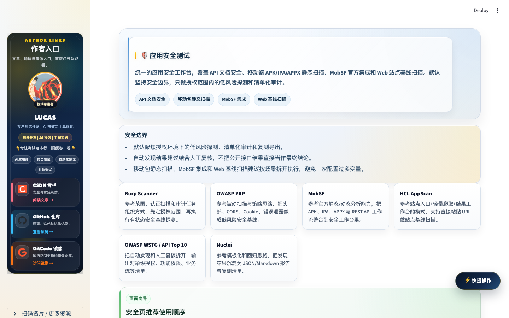

### 工具定位

统一的应用安全工作台，覆盖 API 文档安全、移动端 APK/IPA/APPX 静态扫描、MobSF 官方集成和 Web 站点基线扫描。定位是授权范围内的低风险探测和清单化审计，不是主动攻击平台。

### 安全边界声明

- 默认聚焦授权环境下的低风险探测、清单化审计和复测导出
- 自动发现结果建议结合人工复核，不把开口接口结果直接当作最终结论
- 移动包静态扫描、MobSF 集成和 Web 基线扫描建议按场景拆开执行

### 四大检查能力

#### API 文档安全基线

导入接口文档，对照 OWASP API Top 10 自动检查：

| 检查项 | 对应 OWASP 风险 |
|---|---|
| 认证机制覆盖率 | API1 对象级权限失效 |
| 敏感字段明文返回 | API3 对象属性级授权失效 |
| 限流和频率控制 | API4 资源和速率限制 |
| 功能级权限控制 | API5 功能级授权失效 |
| 批量分配风险 | API6 批量分配 |
| 错误信息泄露 | API8 安全配置错误 |
| 第三方依赖风险 | API9 库存管理不当 |

**输出产物：**
- Markdown 安全报告（问题清单 + 风险级别 + 修复建议）
- OWASP API Top 10 对照清单
- Nuclei 模板包导出（可直接用于后续自动化验证）
- 权限矩阵（角色 × 接口的访问权限表）
- 基于角色的回归验证清单（按不同角色列出需要验证的接口和权限）
- 风险看板（高/中/低风险问题汇总）
- 安全回归套件（导出可复用的安全测试基线检查单）

> **场景举例：** 接口上线前，导入 Postman Collection，工具自动扫描出 3 个未做认证校验的管理端接口，和 2 处响应体包含用户密码 Hash 的接口，提前在开发修复。

---

#### 移动端静态扫描（APK / IPA / APPX）

上传安装包，本地静态分析，无需真机或模拟器。

**扫描项目：**

| 分析维度 | 具体检查 |
|---|---|
| 硬编码敏感信息 | API Key、内网地址、密码、私钥 |
| 网络安全配置 | 是否允许明文 HTTP、证书校验策略 |
| 证书校验绕过 | SSL Pinning 是否被绕过 |
| 调试标志位 | debuggable 是否为 true |
| 权限声明分析 | 危险权限列表（摄像头、位置、通讯录等） |
| 自定义关键词 | 可自定义关键词扫描（如 xposed、frida、root） |

**输出产物：** Markdown 报告、JSON 结果、CSV 明细

> **场景举例：** App 准备提交应用商店，先跑一次静态扫描，找到调试模式开关未关、硬编码了一个内网 IP 地址、SSL 证书校验被注释掉了三个问题，在提交前修复。

---

#### MobSF 集成（进阶）

接入 MobSF 官方服务，获得更完整的静态/动态分析能力。

**配置方式：**
1. 填入 MobSF 服务地址（如 `http://127.0.0.1:8000`）和 API Key
2. 点击「连通性检查」确认服务可用
3. 上传安装包，触发 MobSF 官方静态分析
4. 一键拉取分析结果，工具整理成测试视角报告

**支持能力：**
- 静态分析：比本地扫描更深入，涵盖反编译后的代码逻辑分析
- 动态报告拉取：拉取已完成的动态分析报告（需 MobSF 侧准备模拟器/真机环境）
- 测试视角二次整理：把 MobSF 的原始报告转化为测试人员可直接使用的问题清单

> **部署说明：** Streamlit Cloud 环境下，MobSF 建议配置为远程服务模式（在 Secrets 中填入 `base_url` 和 `api_key`）。本地 Docker、ADB、Frida 等环境在云端不可用。

---

#### Web 站点基线扫描

对 Web 入口做头部安全和暴露面的轻量检查。

**检查项：**

| 类别 | 具体项目 |
|---|---|
| HTTP 安全响应头 | Content-Security-Policy、X-Frame-Options、HSTS、X-Content-Type-Options |
| TLS 配置 | 协议版本、密码套件、证书有效期 |
| 暴露面检查 | 常见管理后台路径（/admin、/swagger-ui、/actuator） |
| Cookie 安全 | Secure、HttpOnly、SameSite 属性 |
| CORS 配置 | 是否允许任意来源 |

**参考工具：** Burp Scanner、OWASP ZAP、MobSF、HCL AppScan、OWASP WSTG/API Top 10、Nuclei

> **注意：** 只对已获授权的目标使用。自动化发现是初筛线索，正式安全测试仍需人工介入。

---

## 8. 禅道绩效统计

### 界面预览

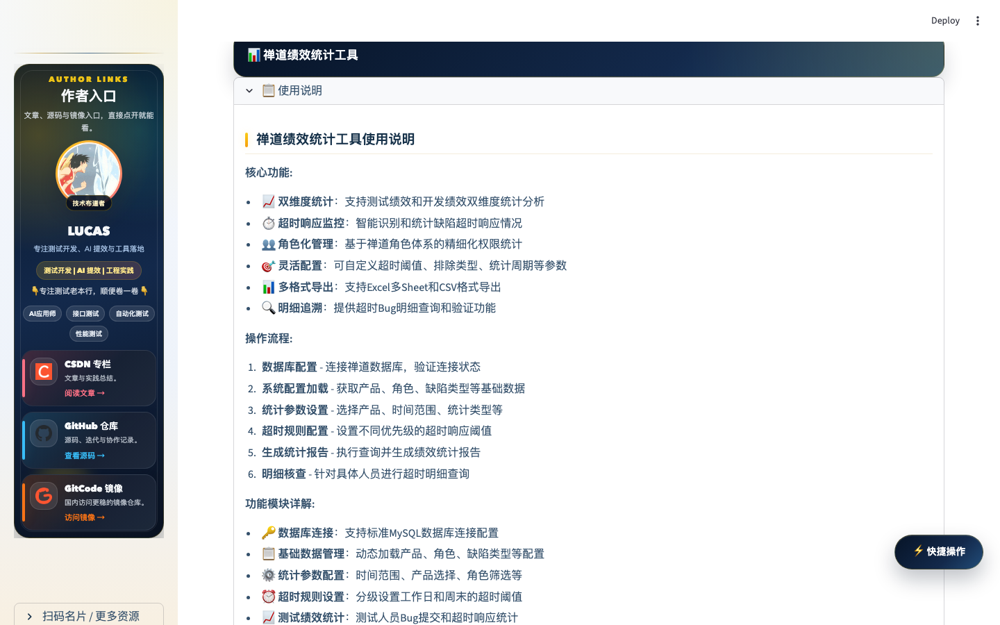

### 工具定位

月底/季度末统计缺陷处理绩效，数据散落在禅道数据库里，手工汇总费时且容易出错。这个工具直连禅道数据库，按配置规则自动统计并导出报表，十分钟出结果。

### 核心能力

| 能力 | 说明 |
|---|---|
| 双维度统计 | 支持测试绩效和开发绩效双维度分析 |
| 超时响应监控 | 智能识别和统计缺陷超时响应情况 |
| 角色化管理 | 基于禅道角色体系的精细化权限统计 |
| 灵活配置 | 可自定义超时阈值、排除类型、统计周期等参数 |
| 多格式导出 | 支持 Excel 多 Sheet 和 CSV 格式导出 |
| 明细追溯 | 提供超时 Bug 明细查询和验证功能 |

### 两种接入模式

**模式一：直连数据库（默认，适合本地/内网）**
直接连接禅道 MySQL 数据库，配置 host/port/database/user/password。

**模式二：HTTP 代理（适合云端部署）**
通过 HTTP 代理服务接入，适合无法直连数据库的场景（如 Streamlit Community Cloud）。云端部署时，代理 URL 和 Token 建议写入 `.streamlit/secrets.toml` 通过 `st.secrets` 读取，避免明文暴露。

### 完整使用流程

```
Step 1  数据库配置
        选择接入模式（直连数据库 / HTTP 代理）
        直连模式：填入 host / port / database / user / password
        代理模式：填入代理服务 URL 和认证 Token
        点击「验证连接」确认可用

Step 2  系统配置加载
        连接成功后，自动加载：
        - 产品列表
        - 角色列表
        - 缺陷类型列表

Step 3  统计参数设置
        - 选择统计产品
        - 设置时间范围（月度/季度）
        - 选择统计类型（测试绩效/开发绩效/双维度）

Step 4  超时规则配置
        按优先级分别设置工作日和周末的超时阈值：
        - P1（紧急）：工作日 24 小时 / 周末 72 小时
        - P2（高）：工作日 72 小时 / 周末 120 小时
        节假日日历：「仅周末」只排除周六/日；选择国家日历（如「中国」）则同时排除法定假日

Step 5  生成统计报告
        点击执行，生成包含以下内容的报告：
        - 成员缺陷提交数、关闭数、响应率
        - 超时响应率和超时次数
        - 测试/开发绩效对比数据

Step 6  明细核查
        对超时条目展开明细，逐条查看：
        - Bug 编号和标题
        - 提交时间 / 响应时间 / 超时时长
        - 负责人

Step 7  导出报表
        导出 Excel（多 Sheet，含汇总和明细）或 CSV
```

### 统计指标说明

| 指标 | 计算方式 |
|---|---|
| 缺陷提交数 | 统计周期内提交的缺陷总数 |
| 缺陷关闭数 | 统计周期内关闭的缺陷总数 |
| 超时响应数 | 超过对应优先级阈值的缺陷数量 |
| 超时响应率 | 超时响应数 / 总分配缺陷数 × 100% |
| 平均响应时长 | 所有缺陷从提交到首次响应的平均时长 |

> **重要建议：** 优先在数据库备份或影子环境验证统计逻辑，再对接生产数据库。统计结果建议结合项目背景和上下文解读，不建议单独以数字评价成员绩效。

---

## 9. 通用效率工具

### 文本对比工具

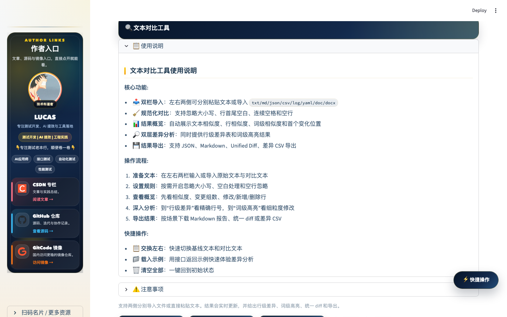

**工具定位：** 两段文本之间的差异对比，行级精确到词级，适合接口返回值对比、文档版本对比、代码片段 diff。

**核心功能：**

| 功能 | 说明 |
|---|---|
| 双栏导入 | 左右两侧分别粘贴文本或导入文件（txt/md/json/csv/log/yaml/doc/docx） |
| 规范化对比 | 支持忽略大小写、行首尾空白、连续空格和空行 |
| 结果概览 | 自动显示文本相似度、行相似度、词组相似度和首个变化位置 |
| 双层差异分析 | 同时提供行级差异表和词级高亮结果 |
| 结果导出 | 支持 JSON、Markdown、Unified Diff、差异 CSV 导出 |

**快捷操作：**
- 交换左右：快速切换基线文本和对比文本
- 载入示例：用接口返回示例快速体验差异分析
- 清空全部：一键回到初始状态

**使用流程：**
1. 在左右两栏输入或导入原始文本与对比文本
2. 按需开启忽略大小写、空白处理和空行忽略
3. 先看概览：查看相似度、变更组数、修改/新增/删除行数
4. 深入分析：到「行级差异」看精确行号，到「词级高亮」看细粒度修改
5. 按场景导出 Markdown 报告、统一 diff 或差异 CSV

> **场景举例：** 两次接口返回了不同的 JSON，把两次结果分别粘入左右栏，词级高亮立刻标出所有不同字段，不需要肉眼逐行比较。

---

### JSON 处理工具

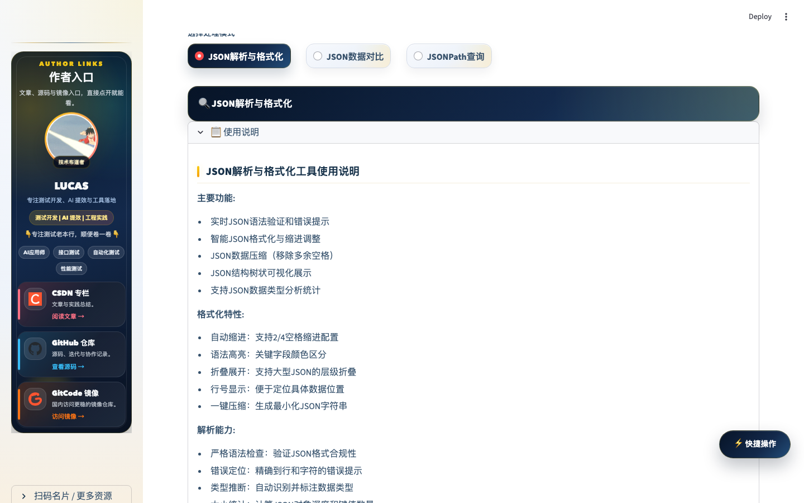

**工具定位：** 接口请求/响应 JSON 的日常处理中心，包含格式化、对比和 JSONPath 查询三大模块。

#### JSON 解析与格式化

**主要功能：**
- 实时 JSON 语法验证和错误提示（精确到行和字符位置）
- 智能格式化与缩进调整（2 空格 / 4 空格）
- JSON 数据压缩（移除所有多余空格，生成最小化字符串）
- JSON 结构树状可视化展示（层级折叠/展开）
- 数据类型分析统计（key 数量、嵌套层级、各类型字段统计）

**格式化特性：**
- 语法高亮：关键字段颜色区分（字符串/数字/布尔/null）
- 折叠展开：支持大型 JSON 的层级折叠
- 行号显示：便于定位具体数据位置
- 一键压缩：生成最小化 JSON 字符串

#### JSON 数据对比

对比两段 JSON 的结构和值差异：
- 字段存在性对比（一方有、一方没有的 key）
- 字段值对比（key 相同但 value 不同）
- 数据类型对比（同一 key 类型变化）
- 结构路径标注（精确定位到嵌套层级的差异）

#### JSONPath 查询

用 JSONPath 表达式从复杂嵌套 JSON 中提取数据：
```
$.data.users[0].name          → 提取第一个用户的名字
$.data.users[*].email         → 提取所有用户的邮箱
$.data.orders[?(@.status==1)] → 过滤状态为1的订单
```

> **场景举例：** 接口返回了一个嵌套很深的 JSON，需要确认某个字段的值。把 JSON 粘进来，格式化后折叠到目标层级，或者直接用 JSONPath 查询提取。

---

### 正则测试工具

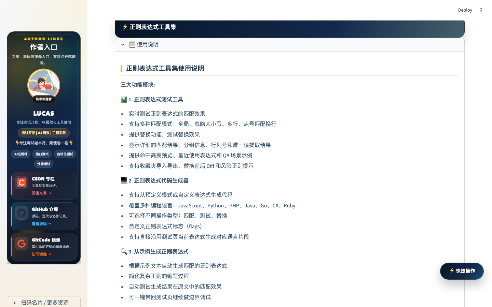

**工具定位：** 正则表达式的编写、调试和代码生成一体化工具集，分为三个模块。

#### 正则表达式测试工具

**主要功能：**
- 实时测试正则表达式的匹配效果
- 支持多种匹配模式：全局、忽略大小写、多行、点号匹配行
- 提供替换功能，测试替换效果
- 显示详细的匹配结果：分组信息、行列号和唯一值提取
- 命令行高亮预览、最近使用表达式和 QA 场景示例
- 支持收藏夹导入导出、替换前后 Diff 和风险正则提示

#### 正则表达式代码生成器

从正则表达式直接生成多语言代码片段：

| 支持语言 | 示例 |
|---|---|
| JavaScript | `const regex = /^1[3-9]\d{9}$/g;` |
| Python | `import re; pattern = re.compile(r'^1[3-9]\d{9}$')` |
| PHP | `preg_match('/^1[3-9]\d{9}$/', $str)` |
| Java | `Pattern.compile("^1[3-9]\\d{9}$")` |
| Go | `regexp.MustCompile("^1[3-9]\\d{9}$")` |
| C# | `new Regex(@"^1[3-9]\d{9}$")` |
| Ruby | `/^1[3-9]\d{9}$/` |

可选操作类型（匹配 / 测试 / 替换），自定义 flags，直接沿用测试页当前表达式生成代码。

#### 从示例生成正则表达式

输入一批示例文本，自动生成能匹配这些示例的正则表达式：
- 简化复杂正则的编写过程
- 自动测试生成结果在原文中的匹配效果
- 一键带回测试页面继续做边界调试

> **场景举例：** 要验证手机号格式校验接口，在代码生成器里输入手机号正则，选 Java，直接把代码片段复制给开发核对正则是否一致。

---

### 日志分析工具

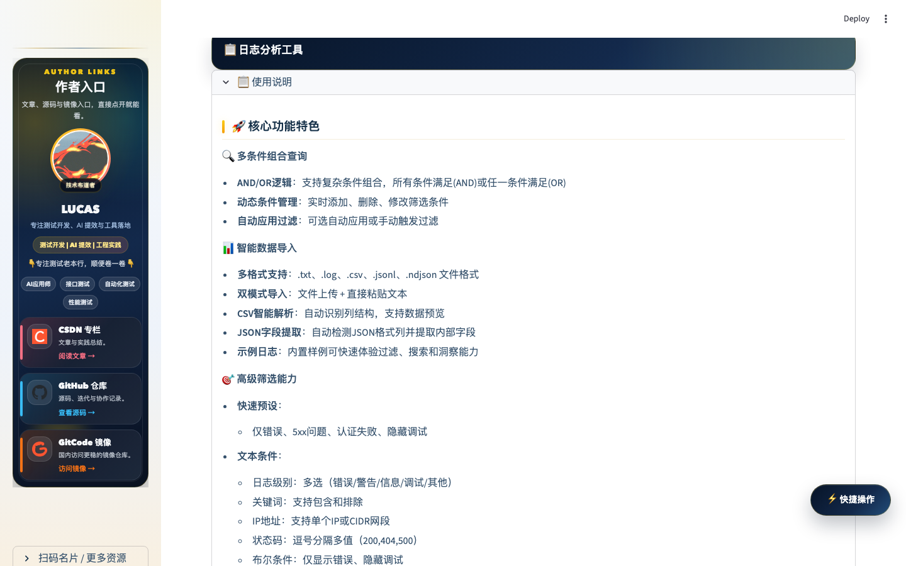

**工具定位：** 面向测试过程中的日志快速分析，支持多条件组合查询、智能导入和高级筛选，帮你从大量日志里快速定位问题。

#### 智能数据导入

| 导入方式 | 说明 |
|---|---|
| 文件上传 | 支持 .txt / .log / .csv / .jsonl / .ndjson |
| 直接粘贴 | 把日志文本直接粘入文本框 |
| 内置示例 | 一键加载内置样例，快速体验过滤和洞察能力 |

**智能解析能力：**
- CSV 自动识别列结构，支持数据预览
- JSONL 自动检测 JSON 格式列并提取内部字段
- 支持混合格式日志（纯文本 + JSON 混排）

#### 多条件组合查询

- **AND/OR 逻辑**：所有条件同时满足（AND）或任一条件满足（OR）
- **动态条件管理**：实时添加、删除、修改筛选条件
- **自动应用过滤**：可选自动应用或手动触发

#### 高级筛选能力

**快速预设（一键应用）：**
- 仅错误：只看 ERROR 级别
- 5xx 问题：只看 HTTP 5xx 状态码
- 认证失败：只看 401/403
- 隐藏调试：过滤 DEBUG 级别，只看有效信息

**文本条件筛选：**

| 筛选维度 | 说明 |
|---|---|
| 日志级别 | 多选（ERROR / WARN / INFO / DEBUG / 其他） |
| 关键词 | 支持包含和排除两种模式 |
| IP 地址 | 支持单个 IP 或 CIDR 网段 |
| 状态码 | 逗号分隔多值（如 200,404,500） |
| 布尔条件 | 仅显示错误 / 仅显示隐藏调试 |

**洞察分析（自动统计）：**
- 日志级别分布统计
- Top N 接口路径（访问量最高的接口）
- Top N IP 地址
- 状态码分布
- 异常消息聚类

> **场景举例：** 测试过程中服务出现 500 错误，从日志里快速定位。上传日志文件，点「5xx 问题」预设，所有 5xx 请求立刻过滤出来，再加关键词条件缩小范围，定位到具体的错误接口和堆栈。

#### CSV / JSON 高级过滤器

对于结构化日志（CSV 或 JSON 格式），支持额外的字段级过滤：

1. 加载文件后，工具自动识别字段列表
2. 选择要过滤的字段（如 `status_code`、`path`、`user_id`）
3. 设置过滤条件（等于/包含/大于/小于）
4. 过滤范围可切换：全部数据 / 已过滤集合（逐层收窄）

#### 全文搜索（高级模式）

- **正则模式**：输入正则表达式进行模式匹配（如 `ERROR.*timeout`）
- **上下文行数**：匹配行前后各显示 N 行（适合定位异常上下文）
- **搜索范围**：可限定在已过滤的结果集内搜索，避免噪音干扰
- **导出路径**：搜索结果可单独导出为 CSV 或 TXT

---

### 字数统计工具

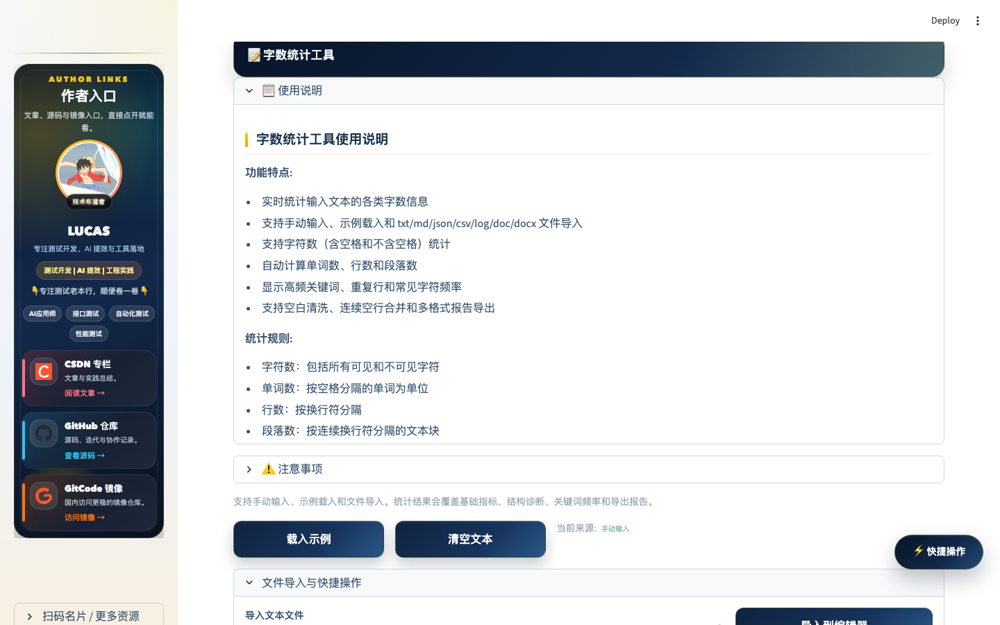

**工具定位：** 文本内容分析中心——从基础字数统计到频率分析、文本清洗和写作目标追踪，适合测试文档分析、内容质量核查和词频挖掘。

**支持的输入格式：** 手动输入 · txt · md · json · csv · log · doc · docx

#### 核心统计指标

| 指标 | 统计规则 |
|---|---|
| 字符数（含空格） | 包括所有可见和不可见字符 |
| 字符数（不含空格） | 排除空格、换行、制表符 |
| 单词数 | 按空格分隔的单词为单位 |
| 行数 | 按换行符分隔 |
| 段落数 | 按连续换行符分隔的文本块 |

#### 五大功能模块

**基础统计 & 概览**
实时显示字符数、词数、行数、段落数，以及中英文字符占比、标点比例和空白比例。

**频率分析**
- 高频关键词（Top N，可过滤停用词）
- 重复行检测和统计
- 常见字符频率分布图

**文本预处理 & 清洗**
- 去除首尾空白（Trim）
- 连续空格折叠（多空格→单空格）
- 连续空行合并（多空行→单空行）
- 清洗后可回填到输入框继续统计

**结构诊断**
识别潜在问题：重复段落、超长行、异常空白、编码异常字符。

**写作目标追踪**
设置目标字数和字符数，进度条实时展示完成度，用于测试文档或报告的篇幅管控。

#### 多格式导出

| 格式 | 内容 |
|---|---|
| JSON | 完整统计数据（适合脚本处理） |
| CSV | 表格形式的频率统计 |
| TXT | 纯文本报告 |
| Markdown | 带格式的统计报告 |

> **场景举例：** 测试报告要求字数不少于 2000 字，把报告草稿粘入工具，一秒显示字符数和进度条，确认达标再提交。

---

### 时间处理工具

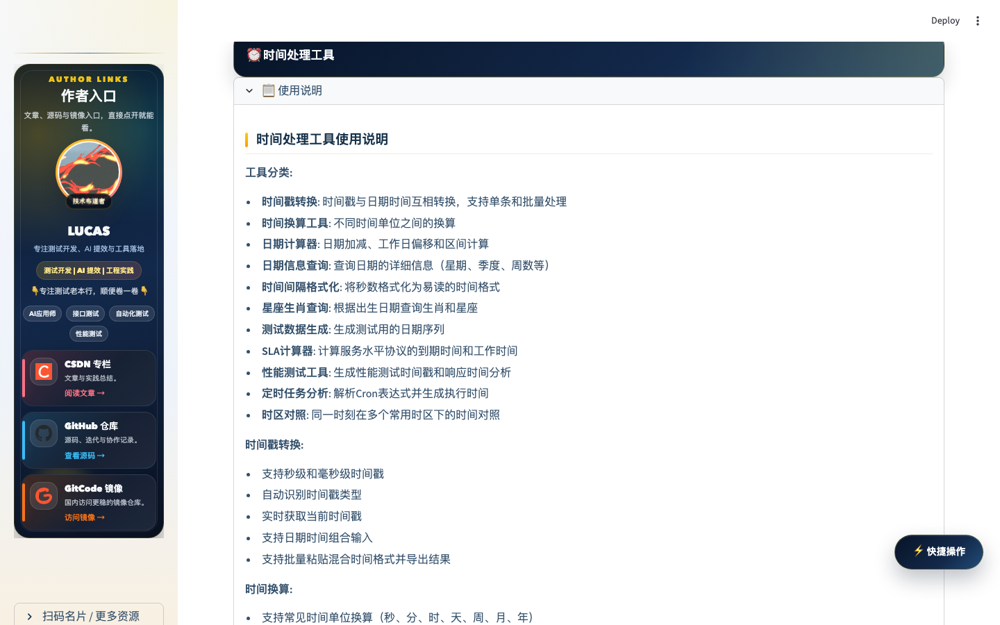

**工具定位：** 测试工作中几乎所有时间相关的处理需求都在这里——时间戳转换、SLA 计算、Cron 预测、性能数据分析，一个工具全覆盖。

#### 11 个子工具

| 子工具 | 功能 |
|---|---|
| **时间戳转换** | 秒级/毫秒级互转，自动识别格式，支持批量粘贴混合格式并导出 |
| **时间换算** | 秒/分/时/天/周/月/年之间的单位换算 |
| **日期计算器** | 日期加减、工作日偏移、区间天数计算、节假日感知 |
| **日期信息查询** | 查询指定日期的星期、季度、周数、是否工作日 |
| **时间间隔格式化** | 把秒数格式化为易读的「X天X时X分X秒」 |
| **星座/生肖查询** | 根据出生日期查询星座和生肖 |
| **测试数据生成** | 生成指定范围内的随机日期序列 |
| **SLA 计算器** | 输入起始时间和 SLA 时限（小时），计算到期时间（支持工作日模式） |
| **性能测试工具** | 输入响应时间数组，计算 P50/P90/P95/P99、平均值、最大值 |
| **定时任务分析** | 解析 Cron 表达式，预测未来 N 次执行时间 |
| **时区对照** | 同一时刻在全球主要城市时区的对照 |

#### 重点功能说明

**批量时间戳转换**
支持粘贴混合格式的时间数据（秒级时间戳、毫秒级时间戳、ISO 8601、日期字符串混排），一键全部转换并导出结果。
```
输入示例：
1712361600
1712361600000
2026-04-06 09:30:00
2026-04-06T01:30:00Z
```

**SLA 计算器**
设置工作时段（如 9:00-18:00）和节假日日历，输入起始时间和承诺响应小时数，精确计算 SLA 到期时间（排除非工作时间）。

> **场景举例：** P1 Bug 要求 24 小时内响应，Bug 提交于周五下午 5 点，工具自动算出到期时间是下周一上午 10 点（排除周末）。

**Cron 表达式分析**
```
输入：0 9 * * 1-5
预测：
  2026-04-13 09:00:00 (周一)
  2026-04-14 09:00:00 (周二)
  2026-04-15 09:00:00 (周三)
  ...
```

> **注意：** 节假日感知功能（工作日计算）支持中国、美国等多个国家的法定节假日日历。

---

### IP/域名查询工具

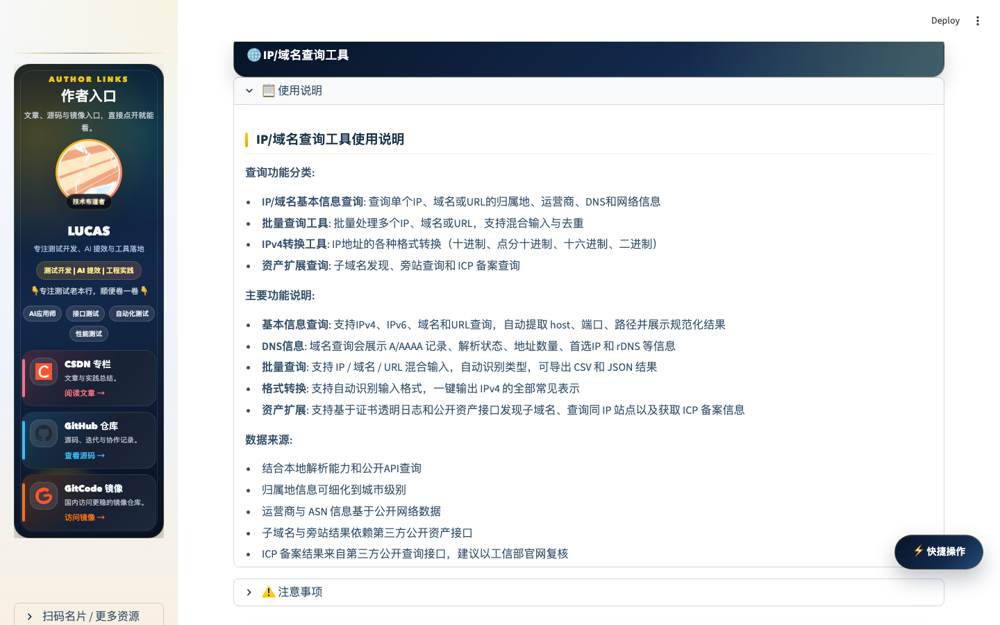

**工具定位：** 测试过程中网络相关信息的一站式查询——IP 归属地、域名解析、格式转换、子域名和备案查询，覆盖接口联调和网络排查的高频场景。

#### 四大查询模块

**① 基本信息查询（单条）**
支持输入：IPv4、IPv6、域名、URL（自动提取 host）

输出信息：
- 归属地（国家 / 省份 / 城市）
- 运营商和 ASN 信息
- DNS 解析记录（A/AAAA 记录、rDNS 反查）
- 首选 IP、地址数量、解析状态
- 一键导出 JSON

**② 批量查询（混合输入）**
- 支持 IP / 域名 / URL 混合输入，每行一条
- **上限：单次最多 50 条**（超出请分批）
- 自动去重处理
- 结果导出 CSV 或 JSON

**③ IPv4 格式转换**
支持各种 IPv4 表示格式互相转换：

| 格式 | 示例 |
|---|---|
| 点分十进制 | `192.168.1.1` |
| 十进制整数 | `3232235777` |
| 十六进制 | `0xC0A80101` |
| 点分十六进制 | `0xC0.0xA8.0x01.0x01` |
| 二进制 | `11000000.10101000.00000001.00000001` |

**④ 资产扩展查询**
- 子域名发现（基于证书透明日志和公开接口）
- 旁站查询（查询同 IP 上的其他站点）
- ICP 备案查询（建议以工信部官网复核为准）

> **注意：** 资产扩展结果依赖第三方公开接口，数据仅供参考，不建议直接作为安全评估的权威依据。

> **场景举例：** 测试环境接口请求超时，打开批量查询，把相关域名和 IP 全部粘入，确认解析是否正常、归属地是否符合预期。

---

### 加密/解密工具

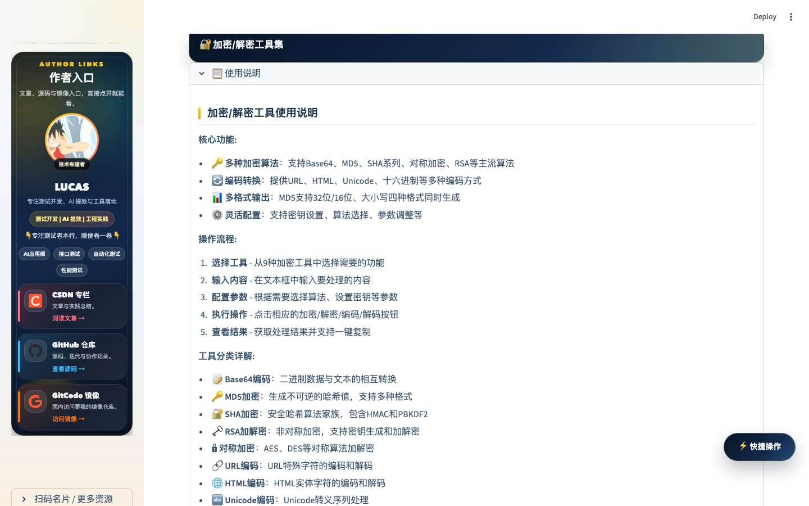

**工具定位：** 接口参数加解密、哈希生成、编码转换的全集工具，覆盖测试中最常见的密码学操作，无需写代码。

#### 九类工具详解

**① 编码/解码（5 种）**

| 编码类型 | 用途 |
|---|---|
| Base64 | 二进制数据与文本相互转换，接口传图片/文件时常见 |
| URL 编码 | 处理请求参数中的特殊字符（空格、中文、符号） |
| HTML 编码 | HTML 实体字符处理（`&amp;`、`&lt;` 等） |
| Unicode 编码 | Unicode 转义序列（`\u4e2d\u6587`） |
| 十六进制 | 二进制数据的十六进制表示 |

**② MD5 哈希**
- 支持 32 位（小写）、32 位（大写）、16 位（小写）、16 位（大写）四种格式
- 不可逆，常用于密码存储验证和文件完整性校验

**③ SHA 哈希家族**
- SHA-1、SHA-224、SHA-256、SHA-384、SHA-512
- HMAC（带密钥的消息认证码）：支持 MD5 / SHA 系列
- PBKDF2（密钥派生函数）：用于密码哈希强化

**④ 对称加密（AES / DES / 3DES）**
- 算法：AES-128/192/256、DES、3DES
- 模式：ECB、CBC、CFB、OFB、CTR
- 填充：PKCS7、ZeroPadding、NoPadding
- > **注意：** 密钥长度须符合算法要求（AES-128 需要 16 字节密钥）；CBC 模式需要提供 IV。

**⑤ RSA 非对称加密**
- 生成 RSA 密钥对（1024 / 2048 / 4096 位）
- 使用公钥加密，私钥解密
- > **注意：** RSA 加密适用于短数据（一般不超过密钥长度 - 11 字节）；加密大文件应使用对称加密，RSA 只加密对称密钥。

#### 使用流程

```
选择工具（左侧 Tab） → 输入内容 → 配置参数（算法/密钥/IV）
→ 执行操作 → 复制或下载结果
```

> **场景举例：** 接口请求参数里有 Base64 编码的图片，直接粘入 Base64 解码，立刻看到原始二进制大小和内容类型。又如验证接口签名逻辑，用 HMAC-SHA256 + 密钥生成签名，与接口返回的签名比对。

---

### 图片处理工具

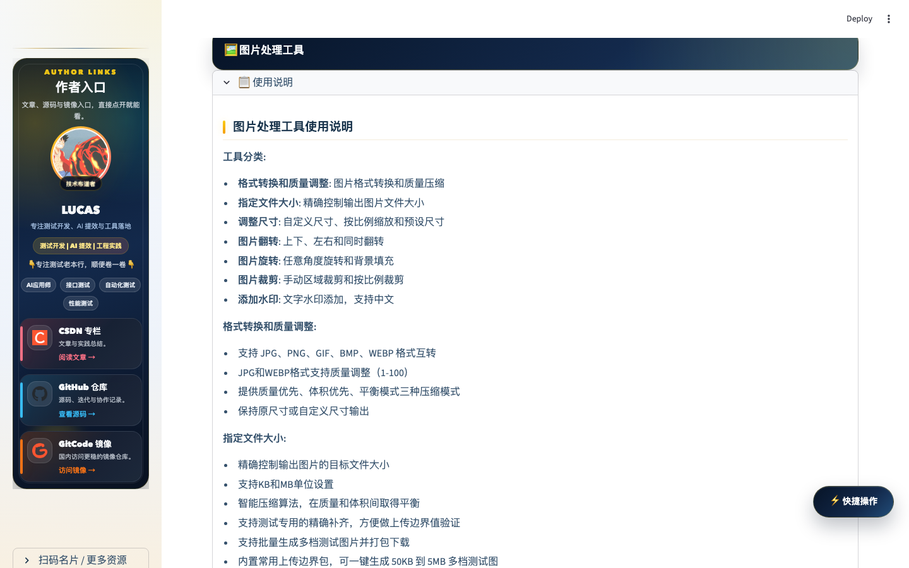

**工具定位：** 测试图片上传接口的最佳搭档——精确控制文件大小、批量生成多档测试图片、格式转换和图片编辑全覆盖。

#### 七大处理功能

**① 格式转换 & 质量调整**

| 支持格式 | 说明 |
|---|---|
| JPG / JPEG | 有损压缩，支持质量调整（1-100） |
| PNG | 无损压缩，不支持 quality 参数（忽略设置） |
| WEBP | 现代格式，支持质量调整（1-100） |
| GIF | 动图格式 |
| BMP | 无压缩位图 |

三种压缩模式：质量优先 / 体积优先 / 平衡模式

> **注意：** PNG 格式不支持 quality 参数，该设置会被忽略；GIF 转换为其他格式时只保留第一帧。

**② 指定文件大小**
精确控制输出图片的目标大小（KB 或 MB），工具自动在质量和体积之间迭代压缩。

内置常用上传边界包，**一键批量生成多档测试图片并打包下载 ZIP**：

| 预设档位 | 用途 |
|---|---|
| 50 KB | 头像/缩略图上传下限测试 |
| 100 KB | 常见图片大小限制 |
| 200 KB | 中等大小限制测试 |
| 500 KB | 较大图片测试 |
| 1 MB | 1MB 边界值测试 |
| 2 MB | 常见最大上传限制测试 |
| 5 MB | 超大图片边界测试 |

> **场景举例：** 测试头像上传接口，要求文件不超过 2MB。批量生成 1.9MB、2MB、2.1MB 三档，分别上传，验证边界处理逻辑。

**③ 调整尺寸**
- 自定义宽高（像素）
- 按比例缩放（指定宽度或高度，另一边自动计算）
- 预设尺寸（1:1 正方形 / 16:9 宽屏 / 4:3 标准 / 3:2 照片 / 9:16 竖屏）
- 重采样算法：LANCZOS（高质量）/ BILINEAR（平衡）/ NEAREST（快速）

**④ 图片翻转**
- 上下翻转
- 左右翻转
- 同时翻转（180° 等效）

**⑤ 图片旋转**
- 任意角度旋转（0-360°）
- 背景填充色自定义（旋转后露出的角落区域）

**⑥ 图片裁剪**
- 手动区域裁剪（指定坐标和尺寸）
- 按比例裁剪（居中裁剪到指定宽高比）
- 交互式裁剪器（需安装 `streamlit-cropper`，不可用时自动降级为手动裁剪）

**⑦ 添加水印**
- 文字水印，支持中文
- 自定义字体大小、颜色、透明度、位置

---

### BI 数据分析工具

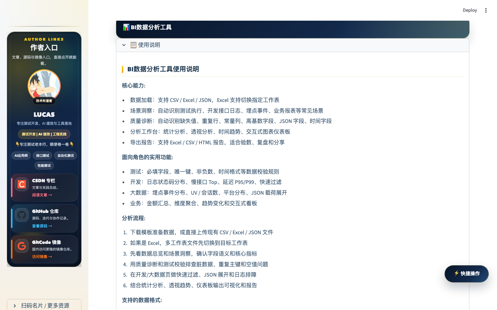

**工具定位：** 面向测试、开发、数据和业务场景的统一验数平台——从数据质量诊断到统计分析、趋势可视化和报告导出，不需要写 SQL 或 Python。

#### 支持的数据格式

| 格式 | 说明 |
|---|---|
| CSV | 自动检测分隔符（逗号/制表符/分号） |
| Excel（.xlsx/.xls） | 支持多工作表切换，加载前选择目标 Sheet |
| JSON | 数组格式 / 对象格式 / 行对象格式（JSON Lines） |

#### 数据加载后的自动识别

加载数据后，工具自动识别：
- 总行数、总列数、缺失值数量、重复行数量
- 完整率（%）和内存占用
- 时间列、数值列、JSON 列（可展开分析）

#### 六大分析标签

**场景洞察**
自动识别数据的业务场景类型，给出核心指标建议：
- 测试执行报告：用例通过率、失败分布、耗时分析
- 接口日志：状态码分布、慢接口 Top N、延迟 P95/P99
- 埋点事件：UV/会话数、平台分布、事件漏斗
- 业务报表：金额汇总、维度聚合、趋势变化

**质量诊断**
自动识别数据质量问题：
- 缺失值（哪些字段缺失、缺失率）
- 重复行（完全重复的记录）
- 常量列（只有一个唯一值的列，通常是无效字段）
- 高基数字段（唯一值过多，通常是 ID 类字段）
- JSON 字段（可进一步展开分析的嵌套字段）

**测试校验**
内置测试常用的数据验证规则：
- 必填字段（检查指定列是否有空值）
- 唯一键约束（检查是否有重复主键）
- 非负数约束（检查数值列是否有负数）
- 时间格式校验（检查时间字段格式一致性）

**分析工作台**
- 统计分析：均值/中位数/标准差/分位数/频率分布直方图
- 透视分析：分组聚合（类似 Excel 数据透视表）
- 时间趋势：时间序列折线图、环比/同比
- 交互式图表仪表板：拖拽配置的可视化看板

**导出报告**
- Excel 多 Sheet（数据概览 + 各分析标签结果）
- CSV 明细
- HTML 可视化报告（适合分享和存档）

#### 推荐使用路径

```
1. 上传数据文件并加载（Excel 先选 Sheet）
   ↓
2. 「场景洞察」确认字段语义和核心指标
   ↓
3. 「质量诊断」+「测试校验」排掉脏数据问题
   ↓
4. 按角色进入对应分析页（测试/开发/大数据/业务）
   ↓
5. 「导出报告」输出可视化报告
```

> **注意：** 建议先排掉质量问题再做分析——基于脏数据的统计结论可靠性很低。

> **场景举例：** 收到一份测试执行记录 Excel，上传后「场景洞察」自动识别为「测试执行报告」，直接展示用例通过率、失败分布和平均耗时，不需要手动算。

---

### 正则测试工具（字段提取向导）

**工具定位：** 正则表达式工具集在之前章节已介绍了三个标签页（测试/代码生成/示例反推），这里补充第四个标签：**字段提取向导**。

#### 字段提取向导

专门面向接口响应和日志场景，帮你快速从文本里提取结构化字段。

**工作流：**
```
1. 输入字段名（如 userId、traceId、errorCode）
2. 粘入待提取的原始文本（接口响应/日志内容）
3. 工具自动推荐候选正则模式（基于字段名语义）
4. 选择候选项后，自动带回正则测试页继续精调
5. 循环调试直到匹配结果符合预期
```

**内置预设的 QA 场景示例：**

| 场景 | 示例正则 |
|---|---|
| 接口响应字段提取 | `"traceId"\s*:\s*"([^"]+)"` |
| 日志关键字段定位 | `ERROR\s+\[(?P<trace>[A-Z0-9-]+)\]\s+(.+)` |
| URL 参数批量清洗 | `([?&]token=)[^&]+` |
| 手机号脱敏 | `1[3-9]\d{4}(\d{4})` |
| 接口路径提取 | `(?:GET|POST|PUT|DELETE)\s+(/[^\s]+)` |

> **场景举例：** 日志里有几百行请求记录，需要提取所有出现了 ERROR 的 traceId。打开字段提取向导，输入 `traceId`，工具推荐正则候选，选一个带入测试页验证，确认匹配无误后一键提取全部结果。

---

## 10. 典型工作流

### 工作流 A：需求截图 → 测试用例（30 分钟内）

```
1. 打开「测试用例生成器」
2. 上传需求截图或原型图 → OCR 识别文字
3. 在「结构化补充」里填入业务规则和验收标准
4. 查看「需求分析助手」提示的覆盖维度和待确认项
5. 选择模型和目标用例数，生成
6. 筛选查看，导出 Excel/CSV 到测试管理工具
```

---

### 工作流 B：接口文档 → 自动化回归（半小时内）

```
1. 打开「接口研发辅助」
2. 导入接口文档 → 文档标准化 → 接口体检
3. 如有版本迭代 → 变更分析 → 生成回归清单
4. 打开「接口自动化测试」
5. 导入整理好的文档 → 生成脚本 → 配置 Base URL 和认证
6. 执行测试 → 下载 HTML 报告
```

---

### 工作流 C：联调前准备

```
1. 「数据生成工具」→「测试场景造数」→ 生成联调数据集并导出 CSV
2. 「接口研发辅助」→「Mock 服务生成」→ 生成可运行的 Mock 脚本
3. 「接口研发辅助」→「调试代码片段」→ 生成 curl/Python 调试代码
4. 「JSON 处理工具」→ 格式化和验证请求参数
5. 「加密/解密工具」→ 处理需要加密的请求字段
```

---

### 工作流 D：上线前安全基线检查

```
1. 「接口安全测试」→「API 文档安全」→ 导入接口文档，执行基线检查
2. 查看 OWASP API Top 10 对照结果，整理高风险问题
3. 如有移动端包 → 「移动包静态扫描」→ 上传 APK/IPA，查看扫描报告
4. 如有 Web 入口 → 「Web 站点基线扫描」→ 检查安全响应头和暴露面
5. 对核心接口 → 「接口性能测试」→ 轻量压测（5~10 并发确认基线）
6. 整合报告，归档到 workspace/reports/
```

---

### 工作流 E：问题日志定位

```
1. 打开「日志分析工具」
2. 上传日志文件或粘贴日志文本
3. 点「5xx 问题」或「仅错误」快速预设
4. 添加关键词条件（如接口路径、错误码）缩小范围
5. 查看「洞察分析」确认高频异常来源
6. 定位到具体错误行，复制上下文给开发
```

---

*最后更新：2026-04-12*
